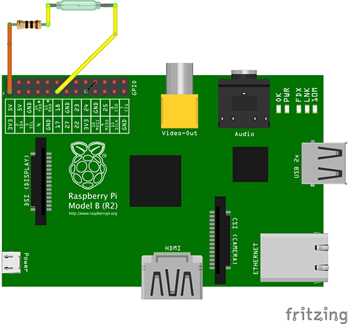

Info
====
This is a work in progress to develop my js skills in developing an API with ExpressJS and MongoDB. Currently this is an API to take care of writing to MongoDB from a RaspberryPi with connected sensors. It will also provide a service for displaying results to an Angular2 app in the future.

At the moment it's a RaspberryPi with just a rain guauge that will send data to an API. More sensors will be added to build it up to a full weather station, including
* wind speed
* wind direction
* temperature
* hummidity
* pressure
* location (GPS)

Repo for UI https://github.com/sube1even/weather-ng

Required
--------
* Install and run MongoDB database service
* NPM install to add all required Node packages
* Node to start index.js everytime server restarts


Docs
----
Plug rain guage into 3.3V(col 1, row 1) and pin #11(GPIO17 col 1, row 6) on RaspberryPi


`ssh pi@192.168.1.6` password `raspberry`

Init setup here https://cylonjs.com/documentation/platforms/raspberry-pi/

Run Node as a service using foreverjs
```
sudo node /home/pi/app/app.js
```
Stop weather service
```
sudo service weather stop
```

Add MongoDB
```
$ sudo apt-get update
$ sudo apt-get upgrade
$ sudo apt-get install mongodb-server
$ sudo service mongod start
```

To start API server
```
node index.js
```

GET to /api/rainfall shows all results
```
http://localhost:3000/api/rainfall
```

POST to /api/rainfall creates an entry eg.
`{"amount":"1","date":"Sat Jul 01 2016 00:43:59 GMT+0930 (ACST)"}`


Technologies
------------
* Node
* Request - Simplifying POST, GET, PUT calls
* CylonJS - Connects to RaspberryPi board pins
* forever-monitor - runs rain.js using forever (installed global)
* forever-service (installed global) - runs app.js on boot
* Express - Route management
* MongoDB - Database storing rainfall data
* SocketIO - (Server) Update SocketIO client to deliver realtime weather to Angular2 frontend


To do
-----
Write '1' value to API with
* location

Add externally accessible url ('NoIP' service or similar)
http://www.noip.com/support/knowledgebase/install-ip-duc-onto-raspberry-pi/

Add location, daily, weekly, monthly, yearly results to API?

Add service bus for queuing ability in case of network connection loss (may not be necessary if server is same place as weather station)
